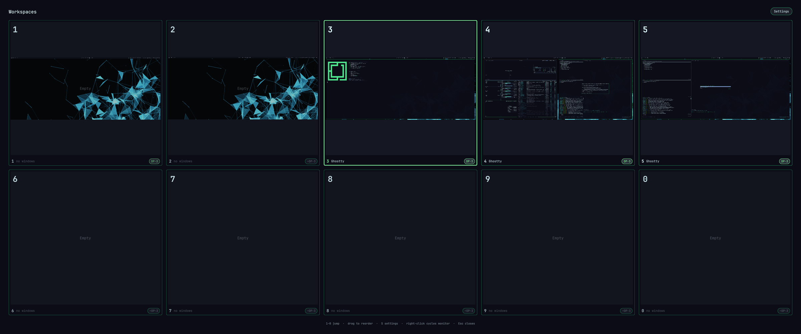

# Workspaces Preview

A Mission Control-style workspace overview for [Omarchy](https://omarchy.org/), built as a Quickshell overlay plugin.



Press `SUPER + ESCAPE` to see all ten workspaces at once, each with a preview of its windows, a big workspace number, the apps running in it, and the monitor it lives on. Press a number to jump straight to the workspace you recognize.

## Features

- 5x2 grid of workspaces 1-10 on every monitor
- Cached workspace previews (screenshots refreshed when you open the overview and whenever you visit a workspace)
- Big overlaid workspace numbers, plus a footer with deduped app names and the monitor badge
- Jump with `1`-`9`, `0` (workspace 10), or by clicking a card
- Highlights the focused workspace and the current monitor
- Right-click a card, or click its monitor badge, to cycle the workspace to the next monitor (`Shift`+click cycles backward)
- Drag cards to reorder workspaces: drop on a card to swap, drop on its edge to insert and shift the rest
- Settings panel (gear button or `S`) with live-applied options
- Follows the active Omarchy theme colors

## Requirements

- Omarchy with Hyprland (tested with Hyprland 0.56 + Quickshell 0.3.1)
- `grim` for workspace snapshots
- `hyprctl` for window moves and monitor cycling

## Install

```bash
omarchy plugin add https://github.com/dzanaga/omarchy-workspaces-preview --enable
```

Or manually:

```bash
git clone https://github.com/dzanaga/omarchy-workspaces-preview \
  ~/.config/omarchy/plugins/io.github.dzanaga.workspaces-preview
omarchy plugin enable io.github.dzanaga.workspaces-preview
```

The plugin adds the `SUPER + ESCAPE` binding itself through a managed Lua file
(`~/.config/hypr/workspaces-preview.lua`) that is included from
`~/.config/hypr/bindings.lua`. If `SUPER + ESCAPE` was previously bound to the
System menu, that binding is replaced.

## Usage

| Input | Action |
| --- | --- |
| `SUPER + ESCAPE` | Toggle the overview |
| `1`-`9`, `0` | Jump to that workspace |
| Click a card | Jump to that workspace |
| Drag a card (> 8px) | Reorder: drop on center to swap, on an edge to insert |
| Right-click a card / click its monitor badge | Cycle the workspace to the next monitor |
| `Shift` + click the badge | Cycle to the previous monitor |
| `S` | Open the settings panel |
| `ESC` | Close the settings panel, then the overview |

## Settings

Open the gear button in the overview (or press `S`). Settings are stored in
`~/.config/omarchy/workspaces-preview/settings.json` and applied live:

- **Labels**: Apps, Titles, Both, or None
- **Preview on open**: `Refresh` recaptures the visible workspaces before the
  overlay maps; `Cached` reuses the last snapshots
- **Show empty workspaces**: On/Off
- **Drag to reorder**: On/Off
- **Show on all monitors**: On/Off
- **Shortcut**: records a new modifier + key combination, checks it against
  `hyprctl binds`, rewrites `~/.config/hypr/workspaces-preview.lua`, and runs
  `hyprctl reload config-only`
- **Reset settings**

## How previews work

Quickshell's per-toplevel `ScreencopyView` did not deliver frames on the
tested Hyprland/Quickshell combination, and capturing the screen while the
overlay is mapped would capture the overlay itself. Instead, the plugin
captures each monitor with `grim`:

- just before the overlay is mapped, so previews are current and never
  include the overlay
- a moment after a workspace becomes visible, refreshing its cached snapshot

Snapshots live in `~/.cache/omarchy/workspaces-preview/ws-<n>.png`. Workspaces
that have never been visited show a spatial placeholder with window rectangles
and app names instead. Because snapshots are full screen captures, XWayland
windows are included.

Reordering moves the windows of the affected workspaces with
`hl.dsp.window.move({ follow = false })` and renames the matching snapshot
files, so numbered slots keep showing the right content.

## Development

The plugin is a directory of QML/JS files with a `manifest.json`:

```
manifest.json            plugin metadata (id, kinds, entry point)
WorkspacesPreview.qml    overlay root: state, snapshots, reorder logic
OverviewSurface.qml      per-monitor layer surface, grid, keyboard, drag/drop
WorkspaceCard.qml        one workspace card
WorkspacePreview.qml     snapshot rendering and placeholders
SettingsPanel.qml        settings dropdown
WorkspacesPreviewModel.js label, geometry, and permutation helpers
settings.default.json    reference defaults
```

For local development, symlink the repository into the plugin directory and
restart the shell after QML changes:

```bash
ln -s "$PWD" ~/.config/omarchy/plugins/io.github.dzanaga.workspaces-preview
omarchy restart shell
```

Validate changes with:

```bash
omarchy plugin validate .
```
